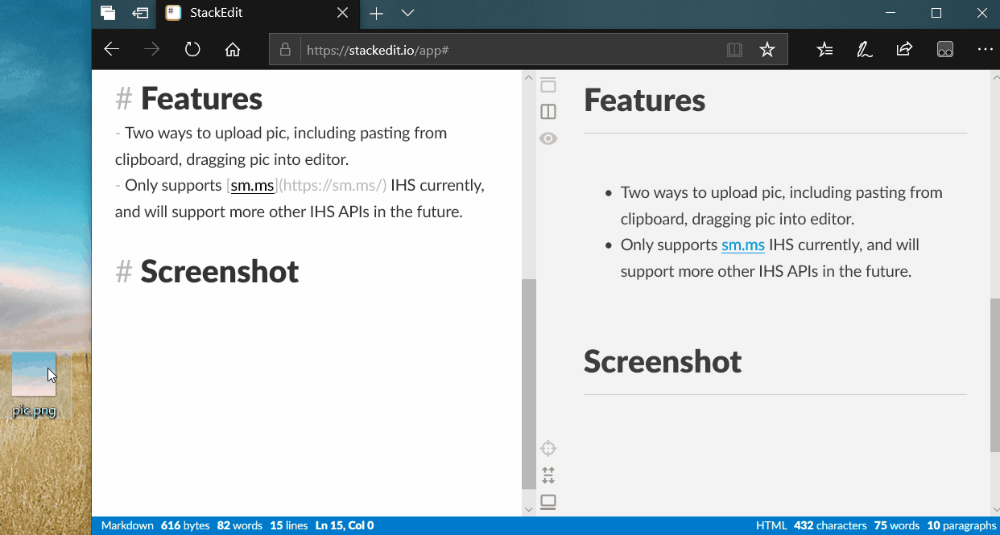

# StackEdit PicToUrl
A StackEdit's plugin base on Tampermonkey, which allows user to upload picture to IHS (image hosting service), and then inserts the url of picture into editor automatically with the syntax "``".

# What is StackEdit
[StackEdit | In-browser Markdown editor](https://www.stakedit.io)

# What is Tampermonkey
[Tampermonkey](https://www.tampermonkey.net/?locale=en)

# Features
- Two ways to upload pic, including pasting from clipboard, dragging pic into editor.
- Only supports [sm.ms](https://sm.ms/) IHS currently, and will support more other IHS APIs in the future.

# Screenshot

